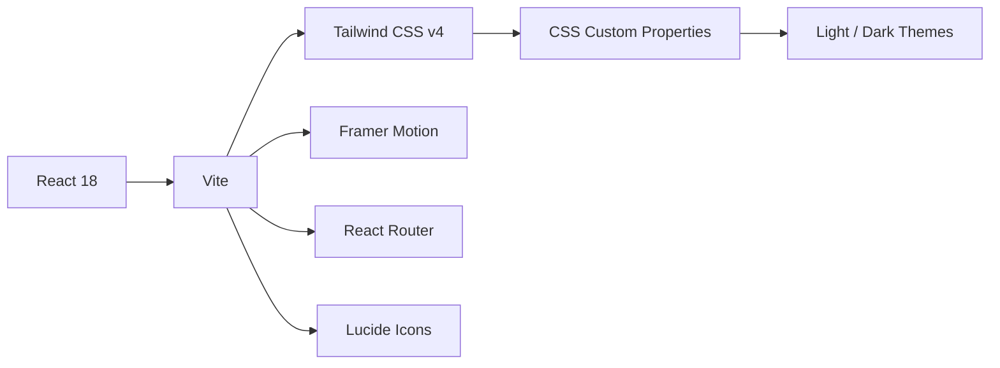

  

<p align="center">
  <br/>
  
  <br/>
  <br/>
  <sub><em>a cozy, kawaii watercolor study companion</em></sub>
</p>

---

Welcome to **PrepMate** — a privacy-first, fully static web application designed to be your gentle, non-judgmental study companion. No login, no tracking, no pressure. Just warm encouragement, soft pastels, and a tiny mascot who believes in you. ✨

---

## 📖 Table of Contents

- [The Vibe ☕](#-the-vibe)
- [Features 🌟](#-features)
- [Tech Stack 🛠](#-tech-stack)
- [Getting Started 🚀](#-getting-started)
- [Adding Content 📂](#-adding-content)
- [Project Structure 🗂](#-project-structure)
- [The Mascot 🐾](#-the-mascot)
- [Themes & Personalization 🎨](#-themes--personalization)
- [Design Philosophy 📐](#-design-philosophy)
- [Deployment 🚢](#-deployment)
- [Contributing 🤝](#-contributing)
- [License 📄](#-license)

---

## ☕ The Vibe

PrepMate is more than a quiz app — it's a feeling. Imagine sitting at a sunlit wooden desk, a warm cup of tea by your side, your favorite stationery spread out, and a gentle mascot cheering you on. That's PrepMate.

```text
┌──────────────────────────────────────┐
│  📚  Study Session in Progress       │
│                                      │
│  ✨ You're doing great!              │
│                                      │
│  🐾  (• •)                          │
│  ────/‾‾‾‾────                       │
│      💬 "You've got this!"            │
└──────────────────────────────────────┘
```

### Core Principles

| Principle | Description |
|-----------|-------------|
| 🧸 **Gentle Feedback** | No harsh sounds, no red flashes, no countdown timers. Wrong answers get empathy. |
| 🎨 **Watercolor Aesthetic** | Soft gradients, paper textures, and hand-drawn feels throughout. |
| 🔒 **Privacy First** | Every byte of your data stays in your browser. No servers. No accounts. |
| 🐾 **Mascot-Led** | A tiny companion guides your journey with warmth and personality. |

---

## 🌟 Features

### 📖 Quiz Engine

| Feature | Details |
|---------|---------|
| ✅ Multiple Choice | Single-correct MCQ format |
| 📝 Instant Feedback | See correct answer highlighted immediately |
| 💡 Explanations | Each question comes with a detailed explanation card |
| 📊 Live Progress | Track correct/wrong/skipped counts in real time |
| ⏭ Skip & Return | Skip questions and come back later — they're saved in a dedicated skipped section |
| 🔖 Bookmarks | Save tricky questions to review later with one tap |

### 🧭 Navigation

| Feature | Details |
|---------|---------|
| 🎚 Jump Slider | A sleek range slider to jump between any question instantly |
| 🔢 Question Grid | A vertical numbered grid shows every question's status at a glance |
| ➡️ Skipped Section | Skipped questions appear in a separate scrollable grid below |
| 📊 Side Stats | Explanation + progress cards slide in after answering |
| 📱 Responsive | Works beautifully on desktop, tablet, and mobile |

### 🎨 Visuals

| Feature | Details |
|---------|---------|
| 🌙 Dark Mode | Warm charcoal theme that's easy on the eyes |
| 🎭 Theme Intensity | Adjust desk background depth (low/medium/high) |
| 💨 Reduced Motion | Toggle for accessibility |
| 🖼 Paper Textures | Subtle grain and paper overlays for a tactile feel |
| 🌊 Gradient Washes | Soft watercolor blobs in blue and peach |

### 🐾 Mascot Companion

| Mood | Expression | When? |
|------|------------|-------|
| 😐 **Idle** | `• •` | Default, gentle breathing animation |
| 🎉 **Cheer** | `^ ^` | Correct answer! |
| 🤔 **Thinking** | `o o` | Pondering a question |
| 💗 **Empathetic** | `u u` | Wrong answer — "Almost had it!" |

---

## 🛠 Tech Stack



| Technology | Purpose |
|------------|---------|
| ⚛️ **React 18** | UI framework |
| ⚡ **Vite** | Build tool & dev server |
| 🎨 **Tailwind CSS v4** | Utility-first styling with custom design tokens |
| 🏃 **Framer Motion** | Butter-smooth animations & transitions |
| 🧭 **React Router** | Hash-based routing (`/#/subjects`, `/#/quiz/:slug`) |
| 🎯 **Lucide React** | Clean, consistent SVG icons |

---

## 🚀 Getting Started

### Prerequisites

- Node.js v18 or higher
- npm v9 or higher

### Installation

```bash
# Clone the repository
git clone https://github.com/your-username/PrepMate.git
cd PrepMate

# Install dependencies
npm install

# Start the dev server
npm run dev
```

Open [http://localhost:5173](http://localhost:5173) in your browser. That's it! 🎉

### Available Commands

```bash
npm run dev        # Start development server
npm run build      # Type-check & build for production
npm run preview    # Preview production build locally
```

---

## 📂 Adding Content

Adding new subjects and questions requires **zero code changes**. PrepMate is fully data-driven.

### 1. Create a Questions File

Create a new JSON file in `public/data/mcqs/` following this structure:

```json
[
  {
    "id": "unique-question-id",
    "type": "mcq",
    "question": "What is the capital of France?",
    "options": [
      { "id": "a", "text": "London" },
      { "id": "b", "text": "Paris" },
      { "id": "c", "text": "Berlin" },
      { "id": "d", "text": "Madrid" }
    ],
    "correct": ["b"],
    "explanation": "Paris has been the capital of France since the 10th century.",
    "difficulty": 1,
    "tags": ["geography", "europe"]
  }
]
```

### 2. Register the Subject

Add an entry to `public/data/subjects.json`:

```json
{
  "slug": "geography",
  "title": "World Geography",
  "description": "Capitals, landmarks, and geographic wonders",
  "icon": "Globe",
  "color": "accent-sage",
  "questionsFile": "mcqs/geography.json",
  "version": "1.0",
  "count": 50,
  "tags": ["geography", "world"]
}
```

| Field | Description |
|-------|-------------|
| `slug` | URL-friendly identifier (used in routes) |
| `title` | Display name on the subject card |
| `description` | Short summary shown below the title |
| `icon` | Lucide icon name (optional, for future use) |
| `color` | CSS color variable name (e.g., `accent-sage`, `primary-200`) |
| `questionsFile` | Path from `public/data/` to your questions JSON |
| `version` | Schema version for future migration support |
| `count` | Total number of questions |
| `tags` | First tag is displayed on the card as a label |

---

## 🗂 Project Structure

```
PrepMate/
├── public/
│   └── data/
│       ├── subjects.json          # Subject manifest
│       └── mcqs/                  # Question JSON files
│           ├── algebra.json
│           ├── biology.json
│           ├── air_mcq_with_explanations.json
│           ├── ajp_mcq_with_explanations.json
│           └── ...
├── src/
│   ├── animations/
│   │   └── framerVariants.ts      # Page transitions & mascot animations
│   ├── components/
│   │   ├── Button.tsx             # 4 variants: primary, secondary, sticker, ghost
│   │   ├── DeskCanvas.tsx         # Background gradient washes & grain texture
│   │   ├── MascotRoot.tsx         # The mascot face, cheeks, & speech bubble
│   │   ├── OptionButton.tsx       # Quiz option with correct/incorrect states
│   │   ├── PaperCard.tsx          # Notebook-style card with ruled lines option
│   │   ├── ProgressBar.tsx        # Top progress indicator
│   │   └── QuestionCard.tsx       # Question text + metadata display
│   ├── contexts/
│   │   ├── SettingsContext.tsx     # Dark mode, theme intensity, reduced motion
│   │   └── StorageContext.tsx     # Bookmarks persisted in localStorage
│   ├── hooks/
│   │   └── useQuizEngine.ts       # Core quiz logic (answers, scoring, navigation)
│   ├── pages/
│   │   ├── LandingPage.tsx        # Welcome screen with tagline
│   │   ├── SubjectListPage.tsx    # Grid of subject notebooks
│   │   ├── QuizPage.tsx           # Main quiz interface
│   │   ├── ResultsPage.tsx        # Post-quiz summary
│   │   ├── BookmarksPage.tsx      # Saved questions review
│   │   └── SettingsPage.tsx       # Appearance & data management
│   ├── utils/
│   │   └── quiz.ts               # Types, validation, shuffle
│   ├── App.tsx                    # Router setup
│   ├── App.css
│   ├── index.css                  # Design tokens, scrollbar styles
│   └── main.tsx                   # Entry point
├── design_tokens.md               # Color, spacing, typography tokens
├── art_direction.md               # Visual & animation guidelines
├── moodboard.md                   # Emotional & aesthetic reference
├── implementation_plan.md         # Architecture & roadmap
├── tailwind.config.js             # Tailwind configuration
└── vite.config.ts                 # Vite configuration
```

---

## 🐾 The Mascot

Our tiny companion is the heart of PrepMate.

### Personality

> *"A tiny, gentle blob with big eyes and a warm presence. It's not judgmental — it's just happy you're studying."*

The mascot is rendered entirely in CSS (no images needed) with:
- A soft pastel pink body (same shade in light and dark mode)
- Small dot eyes that change expression
- Peach blush cheeks
- An idle breathing animation
- A cheerful bounce on correct answers
- A speech bubble with encouraging messages

### Expressions

| Mood | Eyes | Animation |
|------|------|-----------|
| Idle | `• •` | Gentle scale pulse (4s loop) |
| Cheer | `^ ^` | Happy bounce (0.6s) |
| Thinking | `o o` | — |
| Empathetic | `u u` | Gentle sway |

---

## 🎨 Themes & Personalization

### Dark Mode

Toggle dark mode in Settings. The entire UI shifts to a warm charcoal palette — no harsh grays or pure whites. Carefully tuned for long study sessions.

### Theme Intensity

Three levels control the desk background depth:
- **Low** — Light, airy feel
- **Medium** (default) — Balanced warmth
- **High** — Deeper, cozier tones

### Reduced Motion

Respects user preferences. Toggle to disable non-essential animations for accessibility.

### Design Tokens

All colors, spacing, and typography are defined as CSS custom properties in `index.css`. The palette includes:

| Token | Light | Dark | Usage |
|-------|-------|------|-------|
| `--color-desk-light` | `rgb(253, 251, 247)` | `rgb(30, 28, 26)` | Main background |
| `--color-paper-base` | `rgb(255, 249, 246)` | `rgb(50, 46, 43)` | Card backgrounds |
| `--color-ink-main` | `rgb(74, 69, 67)` | `rgb(245, 240, 235)` | Primary text |
| `--color-primary-500` | `rgb(127, 182, 255)` | `rgb(100, 155, 225)` | Buttons & accents |
| `--color-accent-peach` | `rgb(255, 158, 153)` | `rgb(220, 120, 110)` | Warm accents |
| `--color-accent-sage` | `rgb(129, 210, 157)` | `rgb(100, 190, 130)` | Success states |

---

## 📐 Design Philosophy

PrepMate follows four guiding design documents, each capturing a different facet of the experience:

### `moodboard.md`
Emotional and visual inspiration. Pastel color palettes, stationery aesthetics, and the gentle, encouraging tone.

### `art_direction.md`
Rules for mascot illustrations, facial expressions, movement principles, and visual hierarchy. No harsh gradients, no aggressive animations.

### `design_tokens.md`
The numerical backbone of the UI — exact color values, spacing scales, border radii, shadow depths, and font choices.

### `implementation_plan.md`
The architectural roadmap covering component hierarchy, data flow, state management, rendering strategy, and future enhancements.

---

## 🚢 Deployment

PrepMate is designed for seamless static hosting.

### GitHub Pages (Recommended)

A GitHub Actions workflow is included at `.github/workflows/deploy.yml`. Push to `main` and it automatically builds and deploys.

### Manual Build

```bash
npm run build
```

The output in `dist/` is a fully self-contained static site. Serve it with any static file server:

```bash
npx serve dist
```

### Environment

- `BASE_URL` — set via Vite's `--base` flag or `vite.config.ts` for subfolder deployments (e.g., GitHub Pages project site)

---

## 🤝 Contributing

Contributions are warmly welcomed! Here's how to help:

1. 🍴 Fork the repository
2. 🌿 Create a feature branch (`git checkout -b feature/amazing-thing`)
3. 💻 Make your changes
4. ✅ Ensure the build passes (`npm run build`)
5. 📝 Commit with a clear message
6. 🚀 Push and open a Pull Request

### Guidelines

- Follow the existing code style and component patterns
- Maintain the cozy, gentle aesthetic
- Keep accessibility in mind (reduced motion, contrast)
- Add design token overrides for new colors in both light and dark modes

---

## 📄 License

This project is licensed under the **MIT License** — see the [LICENSE](LICENSE) file for details.

---

<p align="center">
  <br/>
  
  <br/>
  <em>PrepMate: Because studying should feel like a warm cup of tea.</em>
  <br/>
  <sub>Built with ✨, ☕, and lots of empathy.</sub>
</p>
