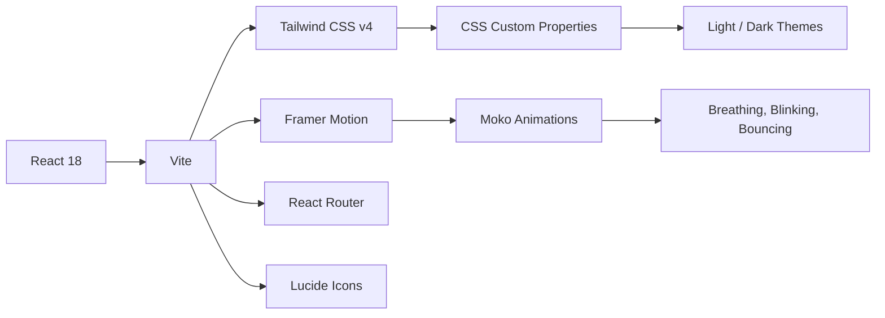

  

<p align="center">
  <br/>
  
  <br/>
  <sub><em>a tiny late-night study world, accompanied by Moko 🐾</em></sub>
  <br/>
  <sub><em>🐾  ☕  🌱  ✨</em></sub>
</p>

---

```
             ╭──────────────────────────────────────╮
             │                                      │
             │   It's late. Rain taps softly         │
             │   against the window.                 │
             │                                      │
             │   A warm desk lamp glows across        │
             │   watercolor notebook pages.           │
             │                                      │
             │   Moko sits beside you,               │
             │   quietly believing in you.            │
             │                                      │
             │          • •                           │
             │        ────/‾‾‾‾────                   │
             │    ☕  "One step at a time"             │
             │                                      │
             ╰──────────────────────────────────────╯
```

Welcome to **PrepMate** — a tiny cozy study world where a gentle companion named **Moko** sits quietly beside you while rain taps softly against the window and warm desk light glows across watercolor notebook pages.

No login. No tracking. No pressure. Just warmth, gentle progress, and a tiny friend who believes in you. ✨

---

## 📖 Table of Contents

- [🐾 Meet Moko](#-meet-moko)
- [☕ The Vibe](#-the-vibe)
- [🌟 Features](#-features)
- [🛠 Tech Stack](#-tech-stack)
- [🚀 Getting Started](#-getting-started)
- [📂 Adding Content](#-adding-content)
- [🗂 Project Structure](#-project-structure)
- [🎨 Themes & Personalization](#-themes--personalization)
- [📐 Design Philosophy](#-design-philosophy)
- [🚢 Deployment](#-deployment)
- [🌱 Contributing](#-contributing)
- [📄 License](#-license)

---

## 🐾 Meet Moko

```
  ╭─────────────────────────────╮
  │                             │
  │   ✦ A tiny companion        │
  │   ✦ Always beside you       │
  │   ✦ Quietly encouraging     │
  │   ✦ Made of watercolor      │
  │     and warmth              │
  │                             │
  ╰─────────────────────────────╯
```

Moko is the emotional heart of PrepMate — a tiny, gentle, watercolor creature who believes in quiet progress.

### Moko's Personality

| Trait | Description |
|-------|-------------|
| 🧸 **Gentle** | Never judges, never pushes. Just sits beside you. |
| 🌙 **Sleepy** | Soft, calm energy — like a late-night study buddy. |
| 💚 **Warm** | Emotionally supportive. Celebrates tiny wins. |
| 🌀 **Curious** | Loves learning alongside you. |
| 🍃 **Calm** | Brings a peaceful presence to every study session. |

### Moko's Expressions

| Mood | Eyes | When? |
|------|------|-------|
| 🌱 **Idle** | `• •` | Default state. Gentle breathing, slow blinking. |
| ✨ **Cheerful** | `^ ^` | Answered correctly! Tiny bounce of joy. |
| 🤔 **Thinking** | `o o` | Pondering a question together. |
| 💚 **Encouraging** | `‿ ‿` | Warm smile, soft encouragement. |
| 💗 **Comforting** | `· ·` | During learning moments — "It's okay, let's grow together." |

### Moko's Style

- Soft rounded blob creature
- Peach blush cheeks
- A tiny sage-green scarf
- Sometimes holds a warm tea mug ☕
- Communicates through handwritten speech bubbles
- Idle breathing animation with slow blinking

### What Moko Says

```
╭──────────────────────────────╮
│  "You're doing great 💚"      │
│  "One small step at a time ✨"│
│  "Moko believes in you ☕"    │
│  "Learning takes time 🌱"    │
│  "You understood another     │
│   tiny thing today ✨"        │
╰──────────────────────────────╯
```

---

## ☕ The Vibe

PrepMate is more than a quiz app — it's a feeling. Imagine sitting at a sunlit wooden desk, a warm cup of tea by your side, your favorite stationery spread out, and Moko quietly cheering you on. That's PrepMate.

```text
┌──────────────────────────────────────┐
│  📚  Rainy Evening Study Session     │
│                                      │
│  ✨ Moko is right beside you          │
│                                      │
│  🐾  (• •)  ────/‾‾‾‾────            │
│      💬 "One tiny step at a time"     │
│                                      │
│  ☕  Warm tea. Soft lamp.             │
│      No rush.                        │
└──────────────────────────────────────┘
```

### Core Principles

| Principle | Description |
|-----------|-------------|
| 🧸 **Gentle Feedback** | No harsh sounds, no red flashes, no countdown timers. Wrong answers get comfort. |
| 🎨 **Watercolor Aesthetic** | Soft gradients, paper textures, floating particles, and handcrafted feels. |
| 🔒 **Privacy First** | Every byte of your data stays in your browser. No servers. No accounts. |
| 🐾 **Moko Companion** | A tiny emotional companion guides your journey with warmth and personality. |
| 🌱 **Growth Language** | No "failure," "performance," or "grind." Only gentle progress and learning moments. |

---

## 🌟 Features

### 📖 Quiz Engine

| Feature | Details |
|---------|---------|
| ✅ Multiple Choice | Single-correct MCQ format |
| 📝 Gentle Feedback | See correct answer highlighted with warmth, not judgment |
| 💡 Explanations | Each question comes with a warm, human explanation |
| 📊 Live Progress | Track correct/learning moments/skipped counts in real time |
| ⏭ Skip & Return | Skip questions and come back later — they're saved in a dedicated section |
| 🔖 Bookmarks | Save questions to revisit — Moko keeps them safe for you |

### 🧭 Navigation & Contribution

| Feature | Details |
|---------|---------|
| 🎚 Jump Slider | A sleek range slider to jump between any question instantly |
| 🔢 Question Grid | A vertical numbered grid shows every question's status at a glance |
| ➡️ Skipped Section | Skipped questions appear in a separate scrollable grid below |
| 📊 Side Stats | Explanation + progress cards slide in after answering |
| 📱 Responsive | Works beautifully on desktop, tablet, and mobile |
| 🗺 Global Navbar | Cozy top navigation with links to Notebooks, Bookmarks, Request Subject, and Settings |
| 📬 Request a Subject | Dedicated page where users can contribute new subjects via Tally form |

### 🎨 Visuals

| Feature | Details |
|---------|---------|
| 🌙 Warm Dark Mode | Cozy charcoal theme — no harsh grays or pure whites |
| 🎭 Theme Intensity | Adjust desk background depth (low/medium/high) |
| 💨 Reduced Motion | Toggle for accessibility |
| 🖼 Paper Textures | Subtle grain and paper overlays for a tactile feel |
| 🌊 Gradient Washes | Soft watercolor blobs in blue and peach |
| ✨ Floating Particles | Gentle dust motes floating in the atmosphere |
| 🧣 Moko Scarf | Tiny sage-green scarf detail on your companion |

### 🐾 Moko Companion

| Mood | Eyes | When? | Moko Says |
|------|------|-------|-----------|
| 🌱 Idle | `• •` | Default, gentle breathing + slow blink | "Moko is here 🌱" |
| ✨ Cheer | `^ ^` | Correct answer! | "You understood another tiny thing today! ✨" |
| 🤔 Thinking | `o o` | Pondering | "Hmm, let's think together..." |
| 💚 Encouraging | `‿ ‿` | Warm encouragement | "You're doing great 💚" |
| 💗 Comforting | `· ·` | Learning moment | "Learning takes time 🌱" |

---

## 🛠 Tech Stack



| Technology | Purpose |
|------------|---------|
| ⚛️ **React 18** | UI framework |
| ⚡ **Vite** | Build tool & dev server |
| 🎨 **Tailwind CSS v4** | Utility-first styling with custom design tokens |
| 🏃 **Framer Motion** | Butter-smooth animations, Moko's breathing & bouncing |
| 🧭 **React Router** | Hash-based routing (`/#/subjects`, `/#/quiz/:slug`) |
| 🎯 **Lucide React** | Clean, consistent SVG icons |

---

## 🚀 Getting Started

### Prerequisites

- Node.js v18 or higher
- npm v9 or higher

### Installation

```bash
# Clone the repository
git clone https://github.com/your-username/PrepMate.git
cd PrepMate

# Install dependencies
npm install

# Start the dev server
npm run dev
```

Open [http://localhost:5173](http://localhost:5173) in your browser. Moko is waiting. 🐾

### Available Commands

```bash
npm run dev        # Start development server
npm run build      # Type-check & build for production
npm run preview    # Preview production build locally
```

---

## 📂 Adding Content

Adding new subjects and questions requires **zero code changes**. PrepMate is fully data-driven.

### 1. Create a Questions File

Create a new JSON file in `public/data/mcqs/` following this structure:

```json
[
  {
    "id": "unique-question-id",
    "type": "mcq",
    "question": "What is the capital of France?",
    "options": [
      { "id": "a", "text": "London" },
      { "id": "b", "text": "Paris" },
      { "id": "c", "text": "Berlin" },
      { "id": "d", "text": "Madrid" }
    ],
    "correct": ["b"],
    "explanation": "Paris has been the capital of France since the 10th century.",
    "difficulty": 1,
    "tags": ["geography", "europe"]
  }
]
```

### 2. Register the Subject

Add an entry to `public/data/subjects.json`:

```json
{
  "slug": "geography",
  "title": "World Geography",
  "description": "Capitals, landmarks, and geographic wonders",
  "icon": "Globe",
  "color": "accent-sage",
  "questionsFile": "mcqs/geography.json",
  "version": "1.0",
  "count": 50,
  "tags": ["geography", "world"]
}
```

| Field | Description |
|-------|-------------|
| `slug` | URL-friendly identifier (used in routes) |
| `title` | Display name on the subject card |
| `description` | Short summary shown below the title |
| `icon` | Lucide icon name (optional, for future use) |
| `color` | CSS color variable name (e.g., `accent-sage`, `primary-200`) |
| `questionsFile` | Path from `public/data/` to your questions JSON |
| `version` | Schema version for future migration support |
| `count` | Total number of questions |
| `tags` | First tag is displayed on the card as a label |

---

## 🗂 Project Structure

```
PrepMate/
├── public/
│   └── data/
│       ├── subjects.json          # Subject manifest
│       └── mcqs/                  # Question JSON files
│           ├── algebra.json
│           ├── biology.json
│           ├── air_mcq_with_explanations.json
│           ├── ajp_mcq_with_explanations.json
│           └── ...
├── src/
│   ├── animations/
│   │   └── framerVariants.ts      # Page transitions & Moko animations
│   ├── components/
│   │   ├── Button.tsx             # 4 variants: primary, secondary, sticker, ghost
│   │   ├── DeskCanvas.tsx         # Background gradient washes, grain texture, floating particles
│   │   ├── FloatingParticles.tsx  # Gentle atmospheric dust motes
│   │   ├── MascotRoot.tsx         # Moko — scarf, 5 expressions, speech bubble, tea mug
│   │   ├── Navbar.tsx             # Global top navigation (desktop + mobile)
│   │   ├── OptionButton.tsx       # Quiz option with correct/learning-moment states
│   │   ├── PaperCard.tsx          # Notebook-style card with ruled lines option
│   │   ├── ProgressBar.tsx        # Top progress indicator
│   │   └── QuestionCard.tsx       # Question text + metadata display
│   ├── contexts/
│   │   ├── SettingsContext.tsx     # Dark mode, theme intensity, reduced motion
│   │   └── StorageContext.tsx     # Bookmarks persisted in localStorage
│   ├── hooks/
│   │   └── useQuizEngine.ts       # Core quiz logic (answers, scoring, navigation)
│   ├── pages/
│   │   ├── LandingPage.tsx        # Welcome screen with tagline
│   │   ├── SubjectListPage.tsx    # Grid of subject notebooks
│   │   ├── QuizPage.tsx           # Main quiz interface with Moko companion
│   │   ├── ResultsPage.tsx        # Post-quiz summary with Moko feedback
│   │   ├── BookmarksPage.tsx      # Saved questions review with Moko empty state
│   │   ├── RequestSubjectPage.tsx # Contribute a new subject via Tally form
│   │   └── SettingsPage.tsx       # Appearance & data management
│   ├── utils/
│   │   └── quiz.ts               # Types, validation, shuffle
│   ├── App.tsx                    # Router setup
│   ├── App.css
│   ├── index.css                  # Design tokens, scrollbar styles
│   └── main.tsx                   # Entry point
├── design_tokens.md               # Color, spacing, typography tokens
├── art_direction.md               # Visual & animation guidelines
├── moodboard.md                   # Emotional & aesthetic reference
├── implementation_plan.md         # Architecture & roadmap
├── tailwind.config.js             # Tailwind configuration
└── vite.config.ts                 # Vite configuration
```

---

## 🐾 Moko — The Companion

```
  ╭──────────────────────────────────────╮
  │                                      │
  │   ✦ Rendered entirely in CSS         │
  │   ✦ Soft pastel pink body            │
  │   ✦ Sage-green scarf detail          │
  │   ✦ Peach blush cheeks               │
  │   ✦ 5 emotional expressions          │
  │   ✦ Handwritten speech bubbles       │
  │   ✦ Idle breathing + slow blinking   │
  │   ✦ Cheerful bounce on correct       │
  │   ✦ Comforting presence on mistakes   │
  │   ✦ Sometimes holds a tea mug ☕      │
  │                                      │
  ╰──────────────────────────────────────╯
```

Moko is built entirely with CSS and Framer Motion — no images, no SVGs. Just code, warmth, and a lot of care.

---

## 🎨 Themes & Personalization

### Warm Dark Mode

Toggle dark mode in Settings. The entire UI shifts to a warm charcoal palette — no harsh grays or pure whites. Carefully tuned for long study sessions and late-night studying.

### Theme Intensity

Three levels control the desk background depth:
- **Low** — Light, airy feel
- **Medium** (default) — Balanced warmth
- **High** — Deeper, cozier tones

### Reduced Motion

Respects user preferences. Toggle to disable non-essential animations for accessibility.

### Floating Particles

Gentle dust motes float across the screen, adding a quiet, alive atmosphere to every page.

### Design Tokens

All colors, spacing, and typography are defined as CSS custom properties in `index.css`:

| Token | Light | Dark | Usage |
|-------|-------|------|-------|
| `--color-desk-light` | `rgb(253, 251, 247)` | `rgb(30, 28, 26)` | Main background |
| `--color-paper-base` | `rgb(255, 249, 246)` | `rgb(50, 46, 43)` | Card backgrounds |
| `--color-ink-main` | `rgb(74, 69, 67)` | `rgb(245, 240, 235)` | Primary text |
| `--color-primary-500` | `rgb(127, 182, 255)` | `rgb(100, 155, 225)` | Buttons & accents |
| `--color-mascot-body` | `rgb(255, 220, 215)` | `rgb(255, 220, 215)` | Moko's body |
| `--color-mascot-cheek` | `rgb(255, 158, 153)` | `rgb(255, 158, 153)` | Moko's blush |

---

## 📐 Design Philosophy

PrepMate follows four guiding design documents, each capturing a different facet of the experience:

### `moodboard.md`
Emotional and visual inspiration. Pastel color palettes, stationery aesthetics, and the gentle, encouraging tone. PrepMate should feel like a warm rainy evening at a cozy desk.

### `art_direction.md`
Rules for Moko's illustrations, facial expressions, movement principles, and visual hierarchy. No harsh gradients, no aggressive animations — only soft, floaty, handcrafted motion.

### `design_tokens.md`
The numerical backbone of the UI — exact color values, spacing scales, border radii, shadow depths, and font choices.

### `implementation_plan.md`
The architectural roadmap covering component hierarchy, data flow, state management, rendering strategy, and future enhancements.

---

## 🚢 Deployment

PrepMate is designed for seamless static hosting.

### GitHub Pages (Recommended)

A GitHub Actions workflow is included at `.github/workflows/deploy.yml`. Push to `main` and it automatically builds and deploys.

### Manual Build

```bash
npm run build
```

The output in `dist/` is a fully self-contained static site. Serve it with any static file server:

```bash
npx serve dist
```

### Environment

- `BASE_URL` — set via Vite's `--base` flag or `vite.config.ts` for subfolder deployments (e.g., GitHub Pages project site)

---

## 🌱 Contributing

```
╭─────────────────────────────╮
│                             │
│   "Moko would love          │
│    your help to grow 🌱"     │
│                             │
╰─────────────────────────────╯
```

Contributions are warmly welcomed! Here's how to help:

1. 🍴 Fork the repository
2. 🌿 Create a feature branch (`git checkout -b feature/gentle-thing`)
3. 💻 Make your changes
4. ✅ Ensure the build passes (`npm run build`)
5. 📝 Commit with a clear, warm message
6. 🚀 Push and open a Pull Request

### Guidelines

- Follow the existing code style and component patterns
- Maintain the cozy, gentle aesthetic — Moko would approve 🐾
- Keep accessibility in mind (reduced motion, contrast)
- Add design token overrides for new colors in both light and dark modes
- Use gentle language — no "failure," "incorrect," or "grind"

---

## 📄 License

```
╭──────────────────────────────╮
│                              │
│  This project is licensed    │
│  under the MIT License.      │
│                              │
│  See the LICENSE file        │
│  for details.                │
│                              │
╰──────────────────────────────╯
```

---

<p align="center">
  <br/>
  
  <br/>
  <em>PrepMate: A tiny study world where Moko sits beside you, rain taps softly, and learning feels like a warm hug.</em>
  <br/>
  <sub>Built with ✨, ☕, 🐾, and lots of empathy.</sub>
  <br/>
  <sub>🐾  • •  ☕  🌱  ✨</sub>
</p>
